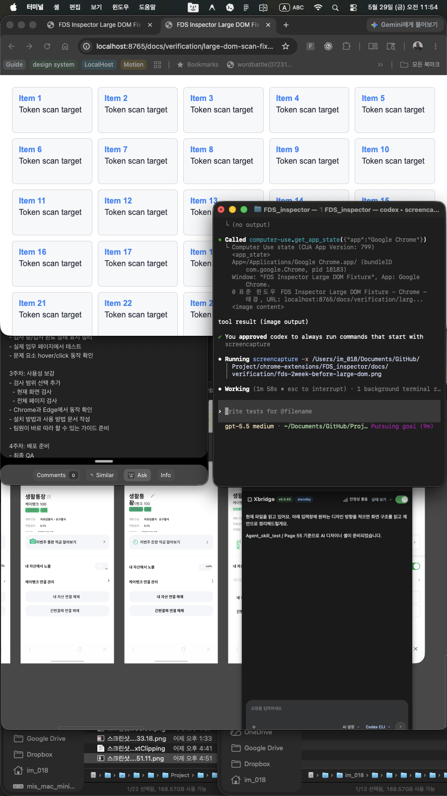
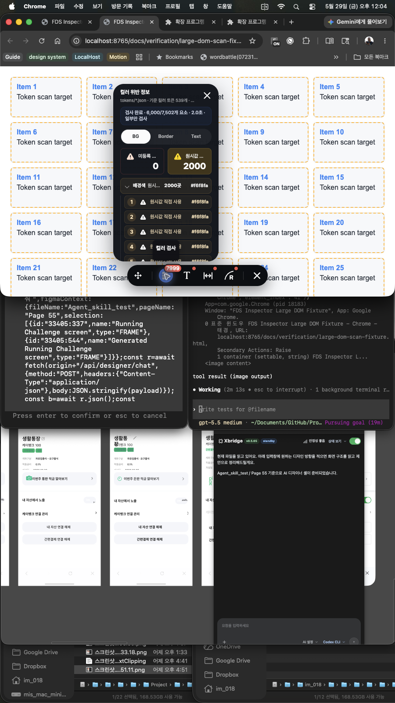
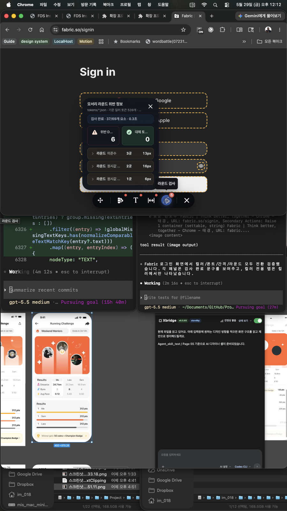
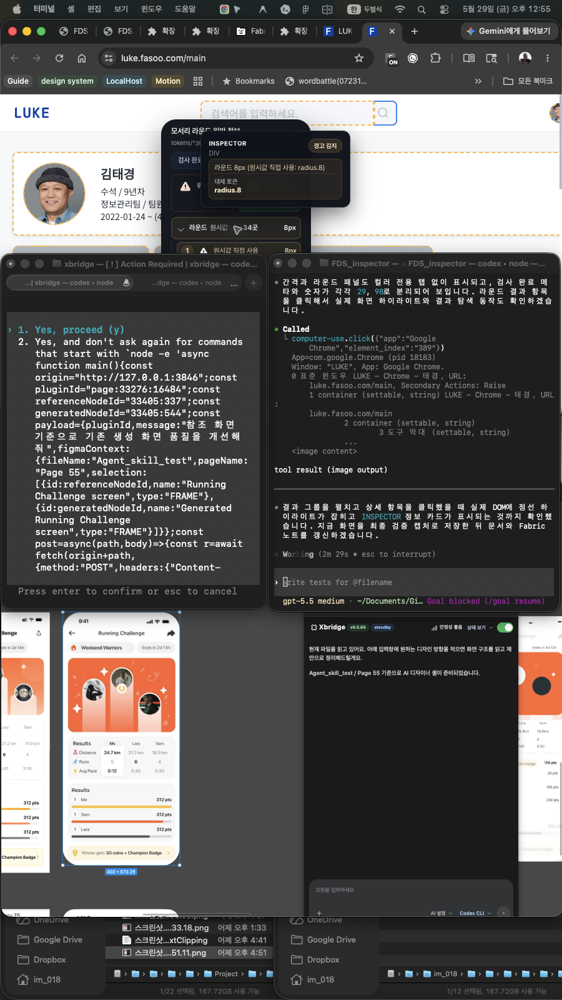
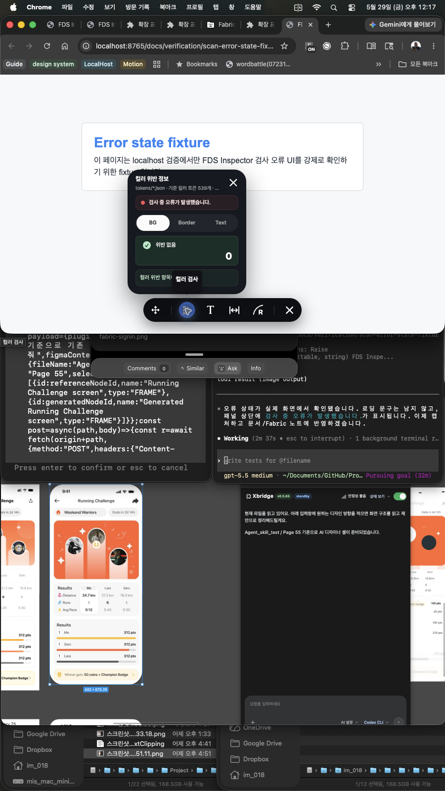

# FDS Inspector 2주차 성능 및 실제 사용 검증

검증 시각: 2026-05-29 12:56 KST

## 작업 목표

큰 페이지에서 FDS Inspector가 멈추지 않고 검사되는지 확인하고, 결과 패널에서 사용자가 현재 상태와 문제 개수를 오해하지 않도록 정리했다. 컬러, 폰트, 간격, 라운드 검사 결과가 서로 섞이지 않는지도 함께 확인했다.

## Before

작업 전 컬러 검사 패널에서는 실제로 문제가 있는 `원시값 직접 사용` 결과가 2,000건이어도, 0건인 `미등록 컬러` 카드가 먼저 선택되어 있었다. 사용자는 위반 항목이 없는 것처럼 볼 수 있었고, 검사 완료 후 몇 개 요소를 검사했는지 확인하기 어려웠다.

## After

작업 후 컬러 검사 패널은 0건 항목 대신 실제 문제가 있는 `원시값 직접 사용 2000`을 자동으로 선택한다. 완료 상태에는 `6,000/7,502개 요소`, `2.0초`, `일부만 검사`가 표시되어 검사 범위와 상태를 바로 알 수 있다.

## 실제 페이지 추가 확인

Chrome에서 실제 외부 웹앱인 Fabric을 열어 확장 주입과 검사 전환을 확인했다. 현재 Chrome 프로필에서는 Fabric 워크스페이스 로그인이 유지되어 있지 않아 `fabric.so/signin` 화면에서 검증했다. 이 화면에서는 컬러, 폰트, 간격, 라운드 검사가 모두 동작했고, 완료 상태는 `37/69개 요소 · 0.3초`로 표시되었다.

## 실제 업무 페이지 최종 확인

Chrome에서 `https://luke.fasoo.com/main` 실제 업무 페이지를 열어 확장 주입, 검사 완료 상태, 패널 전환, 결과 항목 탐색을 최종 확인했다. LUKE 메인 화면에서는 `439/806개 요소 · 13.0초`로 검사가 완료되었고, 페이지 스크롤과 버튼 클릭이 멈추지 않았다.

- 컬러 검사: `249`건 표시. 컬러 패널에서만 `BG`, `Border`, `Text` 탭이 표시되었다.
- 폰트 검사: `0`건 표시. 컬러 전용 탭 없이 `위반 없음` 상태가 표시되었다.
- 간격 검사: `29`건 표시. 컬러 전용 탭 없이 위반 DOM 요소와 대체 토큰 후보가 분리되어 표시되었다.
- 라운드 검사: `98`건 표시. 컬러 전용 탭 없이 위반 DOM 요소와 대체 토큰 후보가 분리되어 표시되었다.
- 결과 항목 클릭: 라운드 결과 그룹을 펼친 뒤 상세 항목을 클릭했을 때 실제 DOM 하이라이트와 `INSPECTOR` 정보 카드가 표시되었다.

## 오류 상태 확인

`scan-error-state-fixture.html`에서 로컬 검증 전용 오류 트리거를 사용해 검사 실패 상태를 확인했다. 오류가 발생해도 로딩 문구가 남지 않고, 결과 패널 상단에 `검사 중 오류가 발생했습니다.` 안내가 표시되었다. 이 트리거는 `localhost`와 `127.0.0.1`에서만 동작하도록 제한했다.

## 확인한 항목

- 큰 페이지 검사 안정성: `large-dom-scan-fixture.html`에서 7,502개 DOM 중 최대 6,000개를 배치 처리로 검사했고, 화면 조작이 멈추지 않았다.
- 검사 중 상태: 초기 검사 중 `초기 검사 결과를 계산하는 중입니다.` 안내가 표시되는 것을 확인했다.
- 검사 완료 상태: 완료 후 검사 개수, 소요 시간, 일부 검사 여부가 결과 패널 상단에 표시되는 것을 확인했다.
- 오류 상태: 로컬 오류 fixture에서 로딩 상태가 해제되고 오류 안내가 표시되는 것을 확인했다.
- 컬러 결과 분리: 컬러 검사에서만 BG, Border, Text 탭이 표시되는 것을 확인했다.
- 폰트/간격/라운드 결과 분리: 폰트, 간격, 라운드 패널에서는 컬러 전용 탭이 표시되지 않는 것을 확인했다.
- 결과 목록 click 동작: 컬러 그룹 항목을 클릭하면 대표 문제 요소가 강조되고 Inspector 카드가 표시되는 것을 확인했다.
- 검사 항목 전환: 컬러에서 문제 카드를 띄운 뒤 폰트 검사로 전환했을 때, 이전 컬러 카드가 남지 않도록 수정하고 확인했다.
- 실제 웹앱 동작: Fabric 로그인 화면에서 컬러 4건, 폰트 12건, 간격 1건, 라운드 6건 결과가 표시되고 각 패널 전환이 동작하는 것을 확인했다.
- 실제 업무 페이지 동작: LUKE 메인 화면에서 컬러 249건, 폰트 0건, 간격 29건, 라운드 98건 결과가 표시되고 각 패널 전환과 결과 항목 클릭이 동작하는 것을 확인했다.

## 수정한 내용

- 큰 DOM 검사를 한 번에 몰아서 처리하지 않고 나누어 처리하는 흐름을 유지해 브라우저 멈춤 위험을 낮췄다.
- 검사 완료 후에도 결과 패널 상단에 검사 범위와 시간을 보여주도록 했다.
- 컬러 검사에서 0건인 항목이 기본 선택되어 실제 문제가 숨겨지는 흐름을 고쳤다.
- 결과 그룹을 클릭했을 때 대표 문제 위치와 Inspector 카드가 보이도록 동작을 보강했다.
- 검사 항목을 바꿀 때 이전 항목의 hover/click 강조와 Inspector 카드가 남지 않도록 정리했다.
- 로컬 검증에서만 사용할 수 있는 오류 상태 fixture를 추가해 오류 UI를 실제 화면으로 확인할 수 있게 했다.
- 컬러 전용 탭은 컬러 검사에서만 나오도록 회귀 테스트로 확인했다.

## 테스트 결과

- `node --check content.js`: 통과
- `npm test`: 98개 테스트 통과, 실패 0개
- 실제 화면 검증: Chrome + Computer Use로 `http://localhost:8765/docs/verification/large-dom-scan-fixture.html`에서 확인
- 오류 화면 검증: Chrome + Computer Use로 `http://localhost:8765/docs/verification/scan-error-state-fixture.html`에서 확인
- 실제 업무 화면 검증: Chrome + Computer Use로 `https://luke.fasoo.com/main`에서 확인

## 남은 작업

- 이번 범위의 최종 검증은 완료했다.
- Before/After 및 LUKE 최종 검증 이미지는 로컬 문서에 포함했으며, Fabric 노트에는 같은 내용과 이미지 경로를 함께 기록한다.
